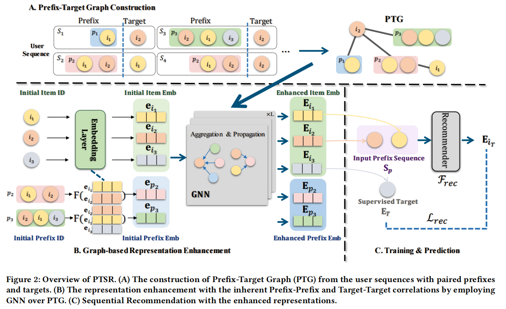

# 📖 PTSR: Prefix-Target Graph-based Sequential Recommendation

This is our Pytorch implementation for the CIKM 2024 Full Paper: **PTSR: Prefix-Target Graph-based Sequential Recommendation**.

- [Paper](https://dl.acm.org/doi/abs/10.1145/3627673.3679718)
- [Slides](https://docs.google.com/presentation/d/1EkSv0QgJbOZQFMyuD7sYiNeA2Rz7WFQqWJJqatf0vZo/edit?usp=sharing)




## Requirement

- **Platforms**: Ubuntu 20.04
- **Device**: RTX 3090, Driver Version: 535.154.05, CUDA Version: 12.2
- Python 3.11
- Torch 2.2
- Cuda 12.1
- numpy<2

The full list is detailed in [requirements](https://github.com/TosakRin/PTSR/blob/main/requirements.txt).

> [!TIP]
> The code may contain some version-specific code. It's recommended to follow our verified environment. You may take some extra effort for older version of Python & PyTorch, but the modification will not be troublesome. It's up to you.

## Installation

```sh
# Step 1: Clone the repository and change directory.
git clone https://github.com/TosakRin/PTSR.git

# Step 2: Create virtual environment.
cd PTSR
conda create -n PTSR python=3.11 -y
conda activate PTSR

# Step 3: Install all the requirements
pip install -r requirements.txt
pip install torch==2.2.0 --index-url https://download.pytorch.org/whl/cu121
```

## Data Preparaion

Please refer to [data/README.md](https://github.com/TosakRin/PTSR/tree/main/data) for data preparation.

We have already provided original sequence files:

- `Beauty.txt`
- `m1-1m.txt`
- `Sports.txt`
- `Toys.txt`

To construct **PTG** in paper, just run the following command:

```sh
python graph.py --msg gen
```

The final data organization:

```sh
$ tree ../data

../data
├── Beauty_graph_50.pkl
├── Beauty_subseq_50.txt
├── Beauty_t_50.pkl
├── Beauty.txt
├── ml-1m_graph_50.pkl
├── ml-1m_subseq_50.txt
├── ml-1m_t_50.pkl
├── ml-1m.txt
├── README.md
├── Sports_graph_50.pkl
├── Sports_subseq_50.txt
├── Sports_t_50.pkl
├── Sports.txt
├── Toys_graph_50.pkl
├── Toys_subseq_50.txt
├── Toys_t_50.pkl
└── Toys.txt
```

## Training/Testing

```sh
# Beauty/Toys/Sports
python main.py --data_name Beauty --do_test --do_eval --gpu_id 0 --msg YOUR_MSG

# ml-1m
python main.py --data_name ml-1m --hidden_dropout_prob 0.1 --do_test --do_eval --gpu_id 0 --msg YOUR_MSG
```

- `data_name`: Beauty/Sports/Toys/ml-1m.
- `gpu_id`: Device ID.
- `msg`: Custom message dentifiers for console output & log file.

## Acknowledgment

- The Code is inspired mostly by [ICSRec](https://github.com/QinHsiu/ICSRec). Thanks for [QinHsiu](https://github.com/QinHsiu)'s great work.
- Transformer and training pipeline are implemented based on [CoSeRec](https://github.com/salesforce/CoSeRec) and [ICLRec](https://github.com/salesforce/ICLRec). Thank them for providing efficient implementation.


## Citation

If this work is helpful for your research, please consider citing the following BibTeX entry.


```
@inproceedings{chen2024ptsr,
  title={PTSR: Prefix-Target Graph-based Sequential Recommendation},
  author={Chen, Jiayu and Du, Xiaoyu and Pan, Yonghua and Tang, Jinhui},
  booktitle={Proceedings of the 33rd ACM International Conference on Information and Knowledge Management},
  pages={239--248},
  year={2024}
}
```
